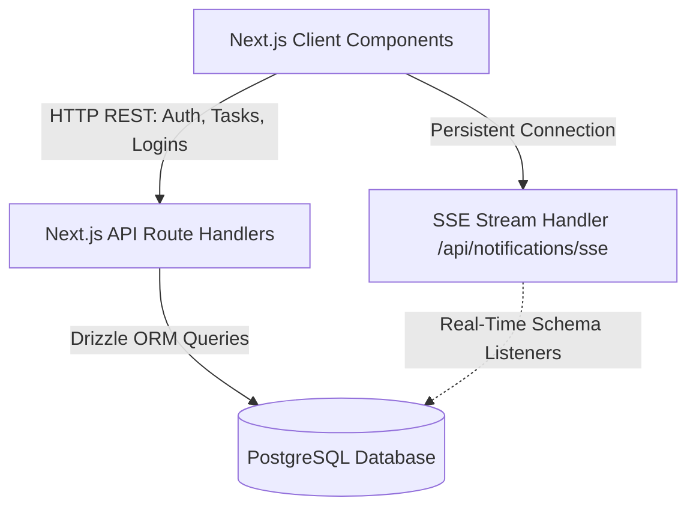

# Disa Track: Enterprise Real-Time Task Tracker

A high-performance workspace execution tracking platform and real-time task manager built on Next.js, Server-Sent Events (SSE), and PostgreSQL.

---

## 🛠️ Core System Architecture

The application is structured as a full-stack Next.js web application utilizing modern app routing, transactional ORM layers, and active database connection pooling.



### 1. Database & ORM Layer
- **Drizzle ORM**: Serves as the type-safe transactional SQL client mapping TypeScript schemas directly to PostgreSQL database tables.
- **Relational Integrity**:
  - `employees`: Stores profiles, designations, case-insensitive custom `login_id` handles, and encrypted credentials.
  - `tasks`: Tracks task priorities, status sequences (`todo`, `in_progress`, `review`, `completed`), assignees, progress ratios, estimated vs. tracked minutes, and timeline deadlines.
  - `activities`: A logging ledger tracking user-triggered events (status shifts, timer logs, and task creations) to generate real-time timeline feeds.
  - `notifications`: Holds real-time alert data for each employee, tracking read/unread flags.

### 2. Full-Stack Routing & State Management
- **Next.js App Router**: Utilizes Next.js Route Groups `(dashboard)` to isolate dashboard sub-routes behind a secure, client-side authentication check.
- **Authentication Guards**: Dynamic redirection automatically gates dashboards, routing unauthenticated users to `/login`.
- **Dashboard Context Provider**: Exposes workspace data, user status, active tracking timers, notifications, and refresh calls via React Context to keep the page elements synced.

---

## ⚡ Real-Time Notification Pipeline

The real-time notifications engine implements a multi-tier connection architecture designed to operate efficiently under different hosting environments.

```
[PostgreSQL Task Insert]
         │
         ▼
[Notification API Trigger]
         │
  ┌──────┴────────────────────────┐
  ▼ (Persistent Support)          ▼ (Serverless Fallback)
[Server-Sent Events (SSE)]     [HTTP Polling Interval]
  │                              │
  ├──────────────────────────────┘
  ▼
[Client State Update]
  ├── Dual-Tone Audio Chime (Web Audio API)
  ├── Speech Synthesis (Browser TTS)
  └── Notification Panel Badge Update
```

- **Server-Sent Events (SSE)**: The `/api/notifications/sse` endpoint utilizes HTTP chunked transfers to stream database notification changes instantly to the active assignee.
- **Web Audio API Alerts**: Plays custom dual-tone chimes (`D5` to `A5` chord transition) generated dynamically through oscillator nodes to prevent asset load delays.
- **Speech Synthesis (TTS)**: Leverages browser-level text-to-speech rendering to read incoming assignments aloud (`"New task assigned: [Title]"`).
- **Serverless Resilience**: In serverless hosting environments (like Netlify or Vercel) where persistent SSE connections are restricted, a client-side **fallback polling mechanism** automatically initiates standard HTTP checks every `6 seconds` if the connection drops.

---

## 🔒 Role-Based Privilege Matrix

The system implements a role-based dashboard representation, separating the **Workspace Administrator** and **Standard Teammates**.

| Interface Capability | Admin (`Anita Sheikh`) | Standard Teammates |
| :--- | :---: | :---: |
| **Workspace Metrics** | Global (Full Workspace Analytics) | Scoped (Personal Progress Only) |
| **Task Creation** | Allowed (Create & Assign) | Restricted (Disabled) |
| **Status Dropdowns** | Full Access (All Tasks) | Scoped (Assigned Tasks Only) |
| **Timer Tracking** | Full Access (All Tasks) | Scoped (Assigned Tasks Only) |
| **Queue Scope** | Full View (All Tasks) | Scoped (Switch between "My Tasks" & "All Tasks" read-only) |
| **Analytics Reports** | Workspace Focus Trends | Personal Time Progression |

---

## ⏱️ Active Timer Persistence Strategy

To ensure zero loss of focus metrics, the time-tracking pipeline is backed by persistent client-memory caches and automatic database status propagation.

```
[Start Timer Trigger] ──► [Auto-Update DB Task Status to 'in_progress']
                                     │
                                     ▼
                      [Store State in LocalStorage]
                                     │
                                     ▼
                   [Dynamic React Context Recomputation]
                 (Live updates stats & reports dynamically)
                                     │
                                     ▼
[Stop Timer Trigger]  ──► [Patch trackedMinutes to PostgreSQL]
```

1. **Auto-Status Propagation**: Starting a timer on any task automatically shifts its status to `"in_progress"` in the database, updating team workloads.
2. **Dynamic Context Intersections**: Rather than waiting for a timer to stop to log metrics, the layout context recalculates tracked minutes on the active task dynamically as the timer ticks. This ensures that the **Overview** stats and **Reports** logs reflect time changes in real-time.
3. **Local Memory Caching**: Active timers are mirrored to the browser's `localStorage`. Tab refreshes, session timeouts, or logout actions do not disrupt the running timer state.

---

## 🚀 Production Deploy Specifications

To deploy the application to a cloud hosting environment:

### Environment Configurations
Define the following environment variables in your deployment dashboard:
- `DATABASE_URL`: The production-level connection string to your hosted PostgreSQL database (e.g. Supabase, Neon).
- `NODE_ENV`: Set to `"production"`.

### Database Sync Pipeline
Initialize your schema in your hosted database instance by running:
```bash
npx drizzle-kit push
```

---

## 👨‍💻 Author & Developed By

### **KARTIK PANDEY**
Lead Full-Stack Software Developer
